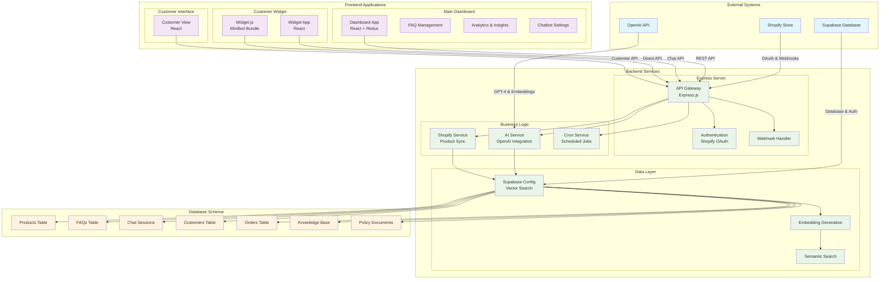
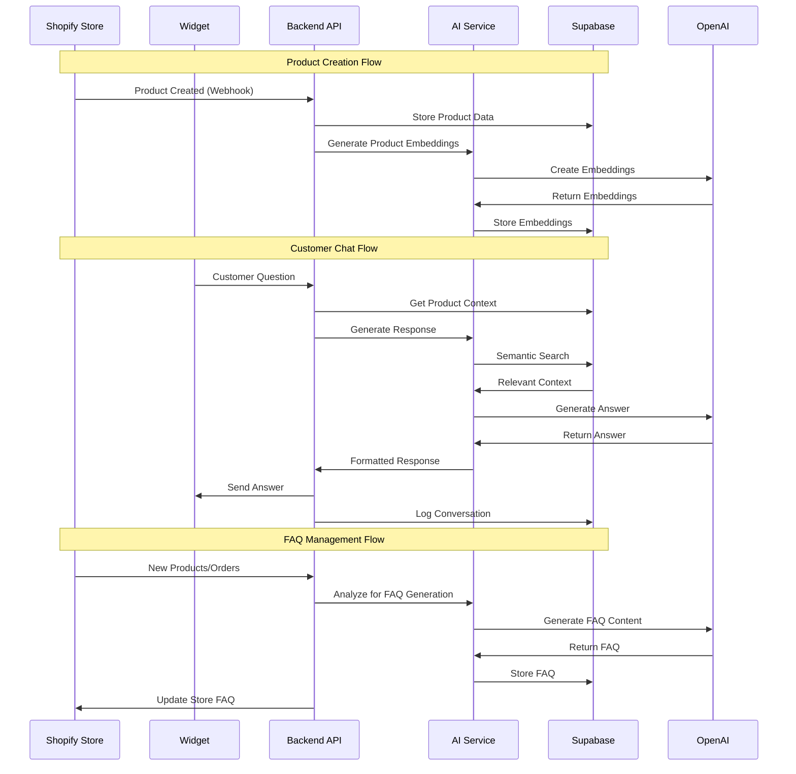
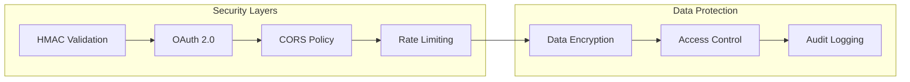
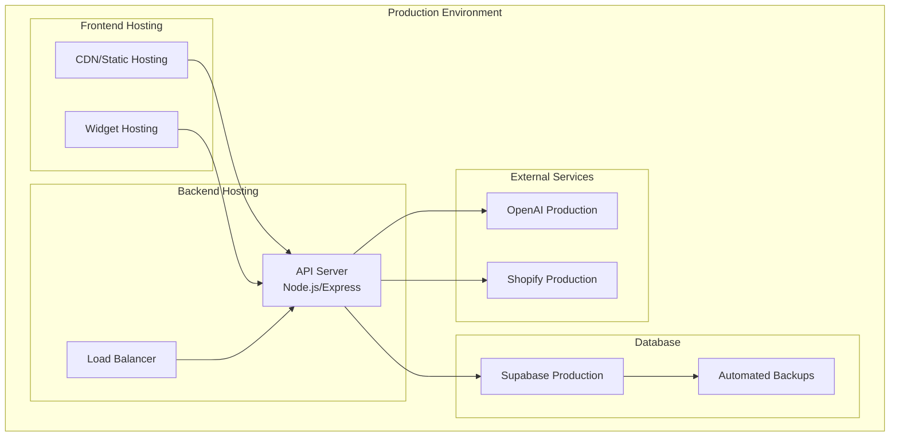

# Sellor-AI Architecture Diagram

## System Overview

Sellor-AI is a comprehensive AI-powered customer support and FAQ management system designed for Shopify merchants. The system provides intelligent chat assistance, automated FAQ generation, and detailed analytics through multiple frontend applications and a robust backend infrastructure.

## Architecture Components

## Data Flow Architecture

## Component Details

### 1. Frontend Applications

#### Main Dashboard (`frontend/`)
- **Technology**: React + Redux + Shopify Polaris
- **Purpose**: Admin interface for merchants
- **Key Features**:
  - FAQ management and editing
  - Chatbot configuration
  - Analytics and insights
  - Customer conversation history
  - Product management

#### Widget Application (`frontend-widget/`)
- **Technology**: React
- **Purpose**: Embeddable chat widget for customer-facing sites
- **Features**:
  - Real-time chat interface
  - AI-powered responses
  - Product context awareness
  - Session management

#### Legacy Widget (`widget/`)
- **Technology**: Minified JavaScript bundle
- **Purpose**: Direct embedding option for stores
- **Features**: Lightweight, single-file deployment

### 2. Backend Services

#### API Gateway (`backend/index.js`)
- **Technology**: Express.js
- **Features**:
  - RESTful API endpoints
  - Shopify OAuth integration
  - Webhook handling
  - Static file serving
  - CORS and middleware management

#### AI Service (`backend/services/aiService.js`)
- **Technology**: OpenAI API integration
- **Features**:
  - GPT-4 powered responses
  - Semantic context retrieval
  - Embedding generation
  - Product relevance checking
  - Unanswered question logging

#### Shopify Service (`backend/services/shopifyService.js`)
- **Technology**: Shopify API integration
- **Features**:
  - Product synchronization
  - Order data retrieval
  - Customer information access
  - FAQ generation triggers

#### Cron Service (`backend/services/cronService.js`)
- **Technology**: Scheduled job management
- **Features**:
  - Automated FAQ generation
  - Data cleanup tasks
  - Analytics aggregation
  - System maintenance

### 3. Data Layer

#### Supabase Configuration (`backend/config/supabase.js`)
- **Technology**: Supabase client with custom RPC functions
- **Features**:
  - Vector similarity search
  - Embedding storage and retrieval
  - Custom error handling
  - Batch operations
  - Schema management

#### Database Schema
- **Products**: Store product information and embeddings
- **FAQs**: Generated and manual FAQ entries
- **Chat Sessions**: Customer conversation history
- **Customers**: Customer profile and order data
- **Knowledge Base**: General knowledge embeddings
- **Policy Documents**: Store policies and terms

### 4. External Integrations

#### Shopify Integration
- **OAuth Flow**: Secure merchant authentication
- **Webhooks**: Real-time product and order updates
- **API Access**: Product, customer, and order data retrieval

#### OpenAI Integration
- **GPT-4**: Advanced conversation responses
- **Embeddings**: Semantic search capabilities
- **Rate Limiting**: Quota management and fallbacks

#### Supabase Integration
- **PostgreSQL**: Primary data storage
- **Vector Search**: Semantic similarity matching
- **Real-time**: Live data synchronization
- **Auth**: User authentication and authorization

## Security Architecture

## Deployment Architecture

## Key Features & Capabilities

### 1. AI-Powered Customer Support
- **Semantic Search**: Context-aware responses using vector embeddings
- **Product Context**: Automatic product information integration
- **Customer History**: Personalized responses based on customer data
- **Fallback Handling**: Graceful degradation when AI is unavailable

### 2. Automated FAQ Management
- **Product-Based Generation**: FAQs generated from product data
- **Order Analysis**: FAQs based on customer order patterns
- **Manual Override**: Admin ability to edit and customize FAQs
- **Version Control**: FAQ history and rollback capabilities

### 3. Analytics & Insights
- **Conversation Analytics**: Chat performance metrics
- **Unanswered Questions**: Tracking of unresolved customer queries
- **Product Performance**: FAQ effectiveness by product
- **Customer Satisfaction**: Response quality metrics

### 4. Multi-Platform Support
- **Shopify Integration**: Native Shopify app capabilities
- **Widget Embedding**: Easy integration into any website
- **API Access**: RESTful API for custom integrations
- **Mobile Responsive**: Optimized for all device types

## Performance Considerations

### 1. Scalability
- **Horizontal Scaling**: Load balancer support for multiple API instances
- **Database Optimization**: Efficient vector search and indexing
- **Caching Strategy**: Redis or similar for frequently accessed data
- **CDN Integration**: Static asset delivery optimization

### 2. Reliability
- **Error Handling**: Comprehensive error management and logging
- **Rate Limiting**: Protection against API abuse
- **Fallback Mechanisms**: Graceful degradation during service outages
- **Monitoring**: Real-time system health monitoring

### 3. Security
- **Data Encryption**: End-to-end encryption for sensitive data
- **Access Control**: Role-based permissions and authentication
- **Audit Logging**: Comprehensive activity tracking
- **Compliance**: GDPR and data protection compliance

This architecture provides a robust, scalable, and secure foundation for AI-powered customer support in e-commerce environments, with particular focus on Shopify integration and user experience optimization. 